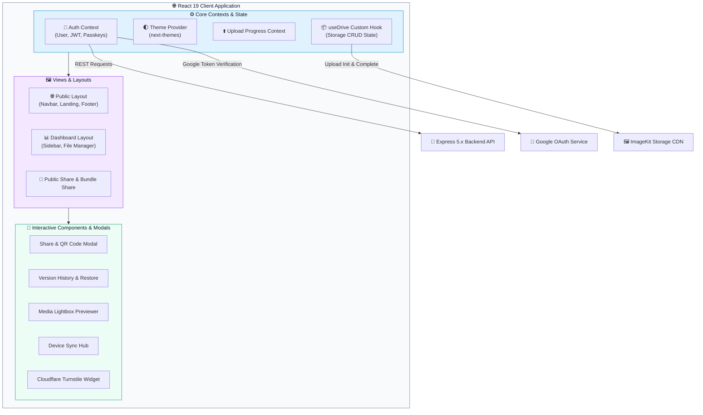

<div align="center">


# Cloud-Based Media Files Storage — Frontend

### Sleek, High-Performance, and Feature-Rich Media Management Client

<p align="center">
  
  
  
  
  
  
</p>

<p align="center">
  <a href="#-overview"><b>Overview</b></a> ·
  <a href="#-features"><b>Features</b></a> ·
  <a href="#-tech-stack"><b>Tech Stack</b></a> ·
  <a href="#-architecture"><b>Architecture</b></a> ·
  <a href="#-app-routes--views"><b>App Views</b></a> ·
  <a href="#-installation--setup"><b>Quick Start</b></a>
</p>

<br/>

</div>

## 📋 Table of Contents

| | | |
|---|---|---|
| [✨ Overview](#-overview) | [🚀 Features](#-features) | [🛠️ Tech Stack](#-tech-stack) |
| [🏗️ Architecture](#-architecture) | [📂 Project Structure](#-project-structure) | [🗺️ App Routes & Views](#-app-routes--views) |
| [⚙️ Installation & Setup](#-installation--setup) | [🔐 Environment Variables](#-environment-variables) | [🤝 Contributing](#-contributing) |
| [📜 License](#-license) | [📞 Contact](#-contact) | |

<br/>

## ✨ Overview

> **Cloud-Based Media Files Storage Frontend** is a state-of-the-art web client designed for intuitive cloud media management, seamless multi-device file operations, and collaborative media sharing.

Built with **React 19**, **Vite 8**, and **Tailwind CSS v4**, this application combines stunning UI design (dark/light themes, WebGL canvas shaders, GSAP animations) with powerful security features including **WebAuthn / FIDO2 Passkeys**, **Google OAuth 2.0**, and **Cloudflare Turnstile** anti-bot verification.

<br/>

## 🚀 Features

<table>
<tr>
<td width="33%" valign="top">

### 🔐 Next-Gen Auth & Security
- **WebAuthn / FIDO2 Passkeys**: Touch ID, Face ID & Hardware Key authentication via `@simplewebauthn/browser`
- **Google One-Tap & OAuth**: Frictionless sign-in with `@react-oauth/google`
- **Cloudflare Turnstile**: Integrated anti-bot challenge widget on authentication forms
- **Email Verification & Reset**: Tokenized verification and password recovery flows

</td>
<td width="33%" valign="top">

### 📁 Advanced Drive Management
- **Drag-and-Drop Uploader**: Multi-file uploader with real-time progress indicators
- **File Versioning**: Version history modal & instant historical version restoration
- **Lightbox Previewer**: High-res image/video preview lightbox modal
- **Starred & Trash Staging**: Favorite items and soft-delete recovery workspace
- **Hidden Items**: Specialized toggleable hidden items section

</td>
<td width="33%" valign="top">

### 🌐 Sharing, Sync & Visuals
- **Public & Bundle Share Links**: Single item and multi-file bundle sharing with passcodes & QR codes
- **Device Sync Hub**: Live tracking and status monitoring across linked user devices
- **Multilingual Support (i18n)**: Seamless language switching with `i18next`
- **Rich Aesthetics**: GSAP physics, WebGL canvas threads, glassmorphism, and dark/light themes

</td>
</tr>
</table>

<br/>

## 🛠️ Tech Stack

### Core Technologies

| Technology | Purpose | Version |
|---|---|---|
|  | Frontend Framework | `^19.2.8` |
|  | Build System & Dev Server | `^8.2.0` |
|  | Utility-First CSS Framework | `^4.3.3` |
|  | Client-Side Routing | `^7.18.2` |

### Key Libraries & Tools

| Library | Purpose |
|---|---|
| `@simplewebauthn/browser` | Passkeys (WebAuthn/FIDO2) client authentication |
| `@react-oauth/google` | Google OAuth 2.0 & Google One-Tap integration |
| `i18next` & `react-i18next` | Internationalization and multi-language localization |
| `gsap`, `@gsap/react`, `motion`, `ogl` | GSAP micro-interactions, Framer Motion, and WebGL background shaders |
| `@lottiefiles/dotlottie-react` | Interactive Lottie animations |
| `imagekit-javascript` | ImageKit CDN client-side integration and direct uploads |
| `jszip` | Client-side zip file compression and bulk downloading |
| `qrcode.react` | Dynamic QR code generation for share links |
| `lucide-react` | Modern icon library |
| `next-themes` | Dark mode and light mode theme switcher |
| `@base-ui/react` & `shadcn` | Accessible, headless UI primitives |
| `socket.io-client` | Real-time WebSocket connection to backend |

<br/>

## 🏗️ Architecture



<br/>

## 📂 Project Structure

```
Cloud-based-Media-Files-Storage-Frontend/
├── 📁 src/
│   ├── 📁 assets/              # Static media assets and branding
│   ├── 📁 components/          # Reusable UI components & visual effects
│   │   ├── 📁 Auth/            # Auth widgets (TurnstileWidget.jsx)
│   │   ├── 📁 ui/              # Headless UI primitives (Shadcn / Base UI)
│   │   ├── 📄 ClickSpark.jsx   # Interactive click spark effect
│   │   ├── 📄 GeometricGridBackground.jsx # WebGL canvas background
│   │   ├── 📄 GoogleOneTapPrompt.jsx     # One-Tap sign-in trigger
│   │   ├── 📄 GradientWaves.jsx# Interactive gradient animation
│   │   ├── 📄 LanguageSelector.jsx # i18n language picker
│   │   ├── 📄 ShareModal.jsx   # Resource sharing & QR code modal
│   │   └── 📄 WebThreads.jsx   # Shader particle threads canvas
│   ├── 📁 context/             # React Context providers
│   │   ├── 📄 AuthContext.jsx       # Authentication & user session state
│   │   ├── 📄 ProgressContext.jsx   # Upload progress state manager
│   │   └── 📄 ThemeProvider.jsx      # Light/Dark mode switcher
│   ├── 📁 hooks/               # Custom React hooks
│   │   └── 📄 useDrive.js      # Central Drive state, file CRUD, uploads & sync
│   ├── 📁 i18n/                # Internationalization config & translation files
│   ├── 📁 layouts/             # App page layouts
│   │   ├── 📄 DashboardLayout.jsx   # Drive navigation & sidebar layout
│   │   ├── 📄 Footer.jsx            # Public site footer
│   │   └── 📄 Navbar.jsx            # Responsive navigation header
│   ├── 📁 lib/                 # Utility libraries
│   │   ├── 📄 cryptoUtils.js   # Encryption & passcode hashing helpers
│   │   └── 📄 permissions.js   # Resource access level validators
│   ├── 📁 pages/               # Application page views
│   │   ├── 📁 Auth/            # Login, Register, VerifyEmail, Password Reset
│   │   ├── 📁 Dashboard/       # Main Drive workspace & modal dialogs
│   │   │   ├── 📄 Dashboard.jsx
│   │   │   └── 📁 components/  # Modals (Versions, DeviceSync, Lightbox, etc.)
│   │   ├── 📄 AboutUs.jsx
│   │   ├── 📄 Changelog.jsx
│   │   ├── 📄 Features.jsx
│   │   ├── 📄 Home.jsx
│   │   ├── 📄 PublicShare.jsx  # Single & bundle public sharing view
│   │   ├── 📄 Security.jsx
│   │   └── 📄 Terms.jsx
│   ├── 📄 App.css              # Custom styling definitions
│   ├── 📄 App.jsx              # Main App component & React Router mapping
│   ├── 📄 index.css            # Tailwind CSS v4 design tokens & root directives
│   └── 📄 main.jsx             # Entry point initialization
├── 📄 .env                     # Local environment configuration
├── 📄 .env.example             # Template for required frontend environment variables
├── 📄 components.json          # Shadcn UI configuration
├── 📄 package.json             # Scripts & package dependencies
├── 📄 vercel.json              # Vercel SPA routing configuration
└── 📄 vite.config.js           # Vite server & build configuration
```

<br/>

## 🗺️ App Routes & Views

### 🌐 Public Pages

| Path | View Component | Description |
|---|---|---|
| `/` | `Home.jsx` | Hero section, features preview, and value proposition |
| `/features` | `Features.jsx` | Detailed breakdown of storage, security & sharing features |
| `/about` | `AboutUs.jsx` | Platform background and engineering vision |
| `/security` | `Security.jsx` | Passkeys, encryption, and data protection overview |
| `/changelog` | `Changelog.jsx` | Release notes and platform updates history |
| `/terms` | `Terms.jsx` | Terms of Service & privacy guidelines |

### 🔐 Auth Views

| Path | View Component | Description |
|---|---|---|
| `/login` | `Login.jsx` | Account login with Password, Passkey, or Google |
| `/signup` | `Register.jsx` | User account creation with Turnstile verification |
| `/verify` | `VerifyEmail.jsx` | Email confirmation landing view |
| `/forgot-password` | `ForgotPassword.jsx` | Password reset request trigger |
| `/reset-password` | `ResetPassword.jsx` | Set new password with reset token |

### 📊 Dashboard Views (JWT Protected)

| Path | Section | Description |
|---|---|---|
| `/dashboard` | My Drive | Root directory folders and files workspace |
| `/dashboard/folder/:id` | Folder View | Subfolder contents, path breadcrumbs & uploads |
| `/dashboard/recent` | Recent Files | Chronological access feed of recently opened/modified files |
| `/dashboard/starred` | Starred Items | Favorite files and folders pinned by user |
| `/dashboard/shared` | Shared With Me | Resources shared directly with the authenticated user |
| `/dashboard/sync` | Device Sync | Multi-device sync hub and active device audit logs |
| `/dashboard/trash` | Trash Bin | Soft-deleted items staging with restore and hard delete |

### 🔗 Public Share Views

| Path | View Component | Description |
|---|---|---|
| `/share/:token` | `PublicShare.jsx` | Public single file/folder preview & download view |
| `/share/bundle/:token` | `PublicShare.jsx` | Public multi-item bundle share viewing & ZIP download |

<br/>

## ⚙️ Installation & Setup

### Prerequisites
- **Node.js** `v18.0.0` or higher
- **npm** `v9.0.0` or higher

### 🚀 Quick Start

**1. Clone the repository**
```bash
git clone https://github.com/ayanmanna123/Cloud-based-Media-Files-Storage-Backend.git
cd Cloud-based-Media-Files-Storage-Frontend
```

**2. Configure Environment Variables**
```bash
cp .env.example .env
```
Set your backend API URL, Google Client ID, ImageKit Public Key, and Turnstile Site Key in `.env`.

**3. Install Dependencies**
```bash
npm install
```

**4. Start Development Server**
```bash
npm run dev
```
Open **[http://localhost:5173](http://localhost:5173)** in your browser.

> 💡 **Tip:** To run both Frontend and Backend concurrently, run:
> ```bash
> npm run both
> ```

<br/>

## 🔐 Environment Variables

| Variable | Required | Description | Example |
|---|---|---|---|
| `VITE_API_URL` | **Yes** | Backend Express API base URL | `http://localhost:5000` |
| `VITE_EMAIL_API_URL` | **Yes** | Email service API endpoint | `http://localhost:5000` |
| `VITE_GOOGLE_CLIENT_ID` | **Yes** | Google OAuth Client ID | `xxx.apps.googleusercontent.com` |
| `VITE_IMAGEKIT_PUBLIC_KEY` | **Yes** | ImageKit public key for media rendering | `public_xxx` |
| `VITE_IMAGEKIT_URL_ENDPOINT` | **Yes** | ImageKit URL endpoint | `https://ik.imagekit.io/your_id` |
| `VITE_TURNSTILE_SITE_KEY` | Optional | Cloudflare Turnstile site key | `1x0000...` |

<br/>

## 🤝 Contributing

Contributions are welcome!

1. **Fork** the repository
2. **Create** your feature branch (`git checkout -b feature/amazing-feature`)
3. **Commit** your changes (`git commit -m "feat: Add amazing feature"`)
4. **Push** to the branch (`git push origin feature/amazing-feature`)
5. **Open** a Pull Request

<br/>

## 📜 License

Distributed under the **MIT License**. See `LICENSE` for details.

<br/>

## 📞 Contact

<div align="center">

### Ayan Manna 👨‍💻

<p>
<a href="https://linkedin.com/in/ayanmanna"></a>
<a href="https://twitter.com/ayanmanna"></a>
<a href="https://github.com/ayanmanna123"></a>
</p>

<br/>

**Made with ❤️ by [Ayan Manna](https://github.com/ayanmanna123) and the open-source community**

</div>