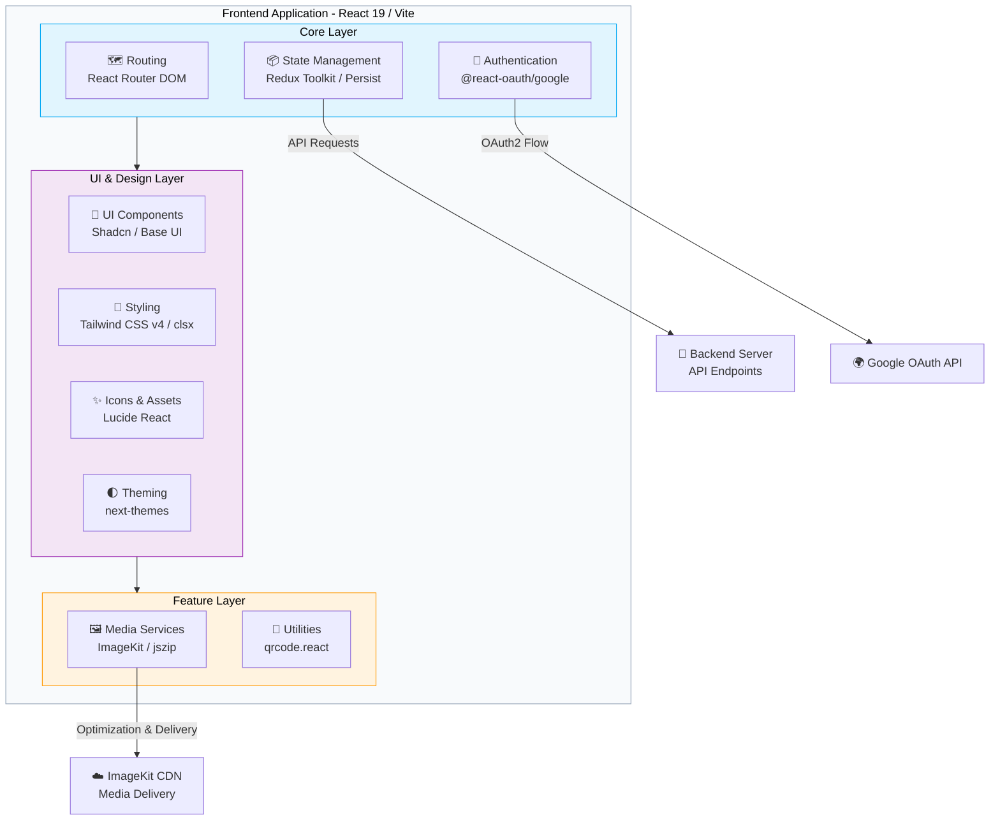

<div align="center">


# Cloud-Based Media Files Storage

### Secure, Fast, and Seamless Cloud Media Management

<p align="center">
  
  
  
  
  
  
</p>

<p align="center">
  <a href="#-overview"><b>Overview</b></a> ·
  <a href="#-features"><b>Features</b></a> ·
  <a href="#️-tech-stack"><b>Tech Stack</b></a> ·
  <a href="#️-installation--setup"><b>Quick Start</b></a> ·
  <a href="#-contributing"><b>Contributing</b></a>
</p>

<br/>


</div>

<br/>

## 📋 Table of Contents

| | | |
|---|---|---|
| [✨ Overview](#-overview) | [🚀 Features](#-features) | [🎯 Target Audience](#-target-audience) |
| [🛠️ Tech Stack](#️-tech-stack) | [🏗️ Architecture](#️-architecture) | [📂 Project Structure](#-project-structure) |
| [⚙️ Installation](#️-installation--setup) | [📸 Screenshots](#-screenshots) | [🤝 Contributing](#-contributing) |
| [🗺️ Roadmap](#️-roadmap) | [📜 License](#-license) | [📞 Contact](#-contact) |

<br/>

## ✨ Overview

> **Cloud-Based Media Files Storage** is a modern web application designed to simplify how you store, manage, and share your media assets.

Built with a sleek, responsive interface, it empowers users with secure authentication, real-time file processing, and robust organization tools — whether you're a creative professional organizing portfolios, a team collaborating on shared assets, or simply backing up your favorite memories.

<br/>

## 🚀 Features

<table>
<tr>
<td width="33%" valign="top">

### 🔐 Secure Authentication
- User registration, login & session management
- One-click **Google OAuth** sign-in
- Simple password recovery flows

</td>
<td width="33%" valign="top">

### 📁 Media Management
- Drag-and-drop or click-to-upload
- Rich previews for images & video
- Intuitive organization & retrieval

</td>
<td width="33%" valign="top">

### ⚡ Performance & UX
- Modern UI with Tailwind CSS & Shadcn
- Predictable state via Redux Toolkit
- Fast delivery powered by ImageKit

</td>
</tr>
</table>

<br/>

## 🎯 Target Audience

| Audience | Why it fits |
|---|---|
| 🎨 **Creative Professionals** | Manage and showcase portfolios with ease |
| 👥 **Teams** | A centralized hub for shared assets |
| 📱 **Everyday Users** | Reliable backups for personal photos & documents |
| 💻 **Developers** | A solid open-source cloud storage frontend to learn from or extend |

<br/>

## 🛠️ Tech Stack

### Frontend Core

| Technology | Purpose | Version |
|---|---|---|
|  | UI Framework | 19.x |
|  | Build Tool | 8.x |
|  | Language | ES6+ |
|  | Styling | 4.x |

### Libraries & Tools

| Technology | Purpose |
|---|---|
|  | State Management |
|  | Navigation |
|  | Media Optimization |
|  | Iconography |

<br/>

## 🏗️ Architecture



<details>
<summary><b>📖 System components explained</b></summary>
<br/>

- **Core Layer** — Application state is managed centrally via **Redux Toolkit** and persisted locally. Navigation uses **React Router DOM**, and user sessions are handled via **@react-oauth/google**.
- **UI & Design Layer** — Responsive layouts built with **Tailwind CSS**, using pre-built accessible components from **Shadcn UI** and **Base UI**, with dark/light mode toggling via **next-themes**.
- **Feature Layer** — Core features leveraging **ImageKit** for optimized media rendering, **jszip** for file compression/handling, and **qrcode.react** for generating sharable codes.
- **External Services** — The frontend communicates with a separate Backend API, uses Google for identity verification, and fetches optimized media assets from ImageKit's CDN.
- **Authentication Layer** — Secure access with OAuth and JWT tokens.

</details>

<br/>

## 📂 Project Structure

```
Frontend/
├── 📁 src/
│   ├── 📁 assets/       # Static assets (images, fonts, etc.)
│   ├── 📁 components/   # Reusable UI components (Shadcn etc.)
│   ├── 📁 context/      # React contexts
│   ├── 📁 hooks/        # Custom React hooks (e.g., useDrive)
│   ├── 📁 layouts/      # Application layouts
│   ├── 📁 lib/          # Library configurations
│   ├── 📁 pages/        # Application views (Auth, Dashboard, etc.)
│   ├── 📁 services/     # API services
│   ├── 📁 store/        # Redux store and slices
│   └── 📄 main.jsx      # Main application component
├── 📄 .env.example      # Environment variables template
├── 📄 package.json      # Dependencies & scripts
└── 📄 vite.config.js    # Build configuration
```

<br/>

## ⚙️ Installation & Setup

### 📋 Prerequisites

Make sure you have the following installed before you begin:

- **Node.js** `v18+` — [Download](https://nodejs.org/)
- **Git** — [Download](https://git-scm.com/)

### 🚀 Quick Start

**1. Clone the repository**

```bash
git clone https://github.com/ayanmanna123/Cloud-based-Media-Files-Storage-Backend.git
cd Cloud-based-Media-Files-Storage-Frontend
```

**2. Set up environment variables**

```bash
cp .env.example .env
```

> Configure your variables (e.g., ImageKit keys, Google Auth Client ID, Backend API URL).

**3. Install dependencies**

```bash
npm install
```

**4. Start the development server**

```bash
npm run dev
```

The app will be running at **[http://localhost:5173](http://localhost:5173)** 🎉

> 💡 **Tip:** To run frontend and backend together, use `npm run both`.

<br/>

## 📸 Screenshots

<div align="center">

<table>
<tr>
<td align="center" width="33%">

<br/><b>🔐 Authentication Flow</b>
</td>
<td align="center" width="33%">

<br/><b>📊 Main Dashboard</b>
</td>
<td align="center" width="33%">

<br/><b>🖼️ Media Preview</b>
</td>
</tr>
</table>

<sub>📝 Replace placeholder images with actual screenshots from your application.</sub>

</div>

<br/>

## 🗺️ Roadmap

- [x] Secure authentication with Google OAuth
- [x] Drag-and-drop media uploads
- [x] Optimized media delivery via ImageKit
- [ ] Shared folders & team permissions
- [ ] Bulk download as ZIP
- [ ] Mobile app companion

<br/>

## 🤝 Contributing

Contributions are welcome from developers of all skill levels! 🚀

1. **Fork** the repository
2. **Clone** your fork
   ```bash
   git clone https://github.com/your-username/Cloud-based-Media-Files-Storage-Frontend.git
   ```
3. **Create** a feature branch
   ```bash
   git checkout -b feature/amazing-feature
   ```
4. **Commit** your changes
   ```bash
   git commit -m "Add amazing feature"
   ```
5. **Push** to your branch
   ```bash
   git push origin feature/amazing-feature
   ```
6. **Open** a Pull Request 🎉

<br/>

## 📜 License

This project is licensed under the **MIT License**. See [LICENSE](LICENSE) for details.

<br/>

## ⭐ Support

If this project helped you, consider:

- ⭐ **Starring** the repository
- 🔗 **Sharing** it with your network
- 🐛 **Reporting** issues and suggestions

<br/>

## 📞 Contact

<div align="center">

### Ayan Manna 👨‍💻

<p>
<a href="https://linkedin.com/in/ayanmanna"></a>
<a href="https://twitter.com/ayanmanna"></a>
<a href="https://github.com/ayanmanna123"></a>
</p>

<br/>

**Made with ❤️ by [Ayan Manna](https://github.com/ayanmanna123) and the amazing open-source community**

<sub>Last updated: August 2026</sub>

</div>